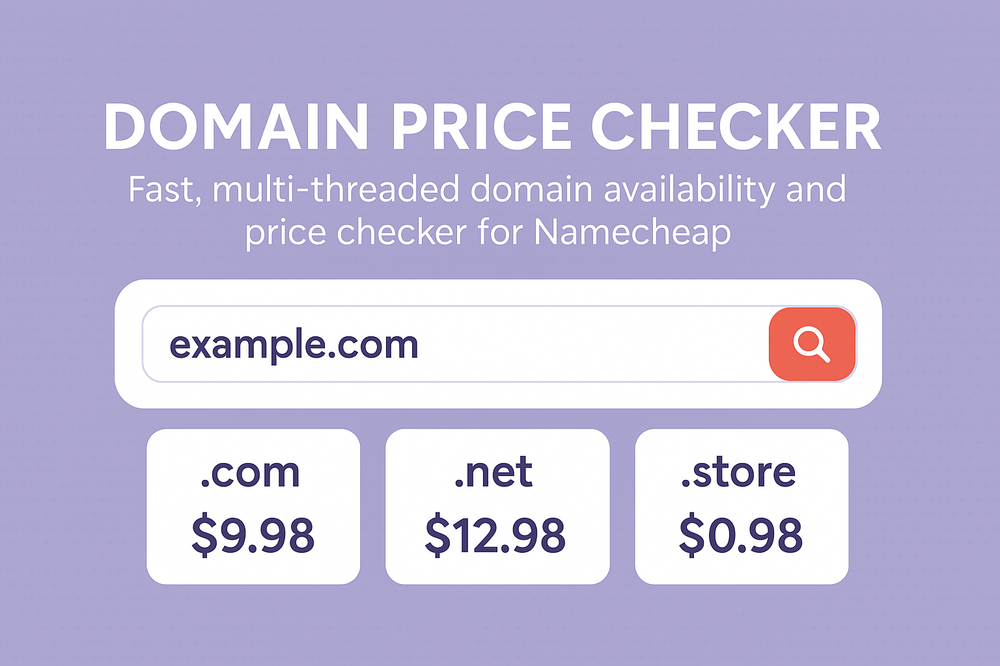
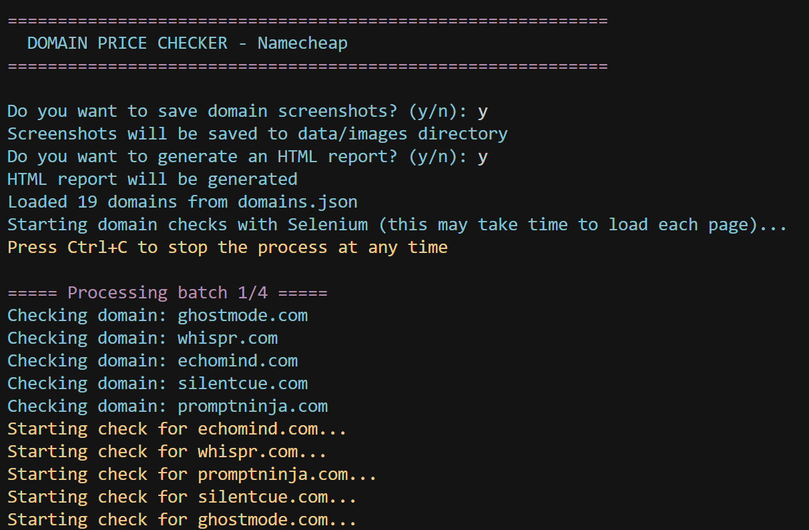
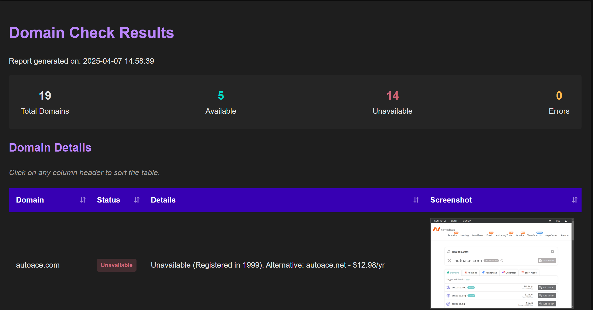

# Domain Price Checker

<div align="center">
  
  <p><em>Fast, multi-threaded domain availability and price checker for Namecheap</em></p>
</div>

## 🚀 Features

- **⚡ Concurrent Domain Checking**: Check multiple domains simultaneously with multi-threading
- **📸 Screenshot Capture**: Optionally save screenshots of search results for visual reference
- **📊 Beautiful HTML Reports**: Generate professional-looking reports with analytics and filtering
- **🖥️ Clean Console Interface**: Color-coded terminal output for easy reading
- **⏹️ Graceful Interruption**: Stop checks at any time with Ctrl+C without losing data
- **🔎 Detailed Results**: Shows availability status, pricing, and alternative TLDs
- **📁 Organized Output**: Saves results in CSV format and cleans up temporary files

## 📋 Prerequisites

- Python 3.6 or higher
- Chrome browser installed (for Selenium)
- ChromeDriver (automatically managed)

## 🔧 Installation

1. Clone the repository:
   ```bash
   git clone https://github.com/yourusername/domainfinder.git
   cd domainfinder
   ```

2. Create a virtual environment and activate it:
   ```bash
   python -m venv env
   # On Windows
   env\Scripts\activate
   # On macOS/Linux
   source env/bin/activate
   ```

3. Install the required packages:
   ```bash
   pip install -r requirements.txt
   ```

## 📄 Configuration

Create a `domains.json` file in the project root with your list of domains to check:

```json
[
  "example.com",
  "mydomain.net",
  "coolproject.io",
  "newstartup.app"
]
```

## 🚀 Usage

Run the script:

```bash
python main.py
```

The script will prompt you with two questions:
- Whether to save screenshots of the domain search results
- Whether to generate an HTML report after completion

<div align="center">
  
</div>

### Reports and Data

After completion, the tool generates:
- A CSV file with all results in the `data` directory
- An HTML report (if selected) for easy browsing of results
- Domain screenshots (if selected) in the `data/images` directory

<div align="center">
  
</div>

## 🛠️ How It Works

The tool uses headless Chrome browser automation to check domain availability on Namecheap, properly parsing results for accurate pricing information. Advanced concurrency allows for efficient batch processing while maintaining a reasonable request rate.

When checking domains, the tool:
1. Processes domains in configurable batches using a thread pool
2. Extracts exact pricing information from the page
3. Identifies unavailable domains and shows registration information
4. Suggests alternative TLDs when the exact domain is unavailable
5. Captures screenshots of results for visual verification

## ⚙️ Customization

You can modify these parameters in the script:
- `batch_size` in the `bulk_check` function to adjust concurrent processing
- `wait_time` in the `check_namecheap_price` function to change page load wait time

## 📝 License

This project is licensed under the MIT License - see the [LICENSE](LICENSE) file for details.

## 🤝 Contributing

Contributions, issues, and feature requests are welcome! Feel free to check the [issues page](https://github.com/yourusername/domainfinder/issues).

## 🙏 Acknowledgements

- [Selenium](https://selenium-python.readthedocs.io/) for browser automation
- [BeautifulSoup](https://www.crummy.com/software/BeautifulSoup/bs4/doc/) for HTML parsing
- [Colorama](https://pypi.org/project/colorama/) for terminal colors 